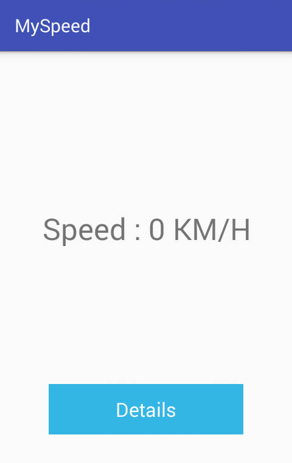
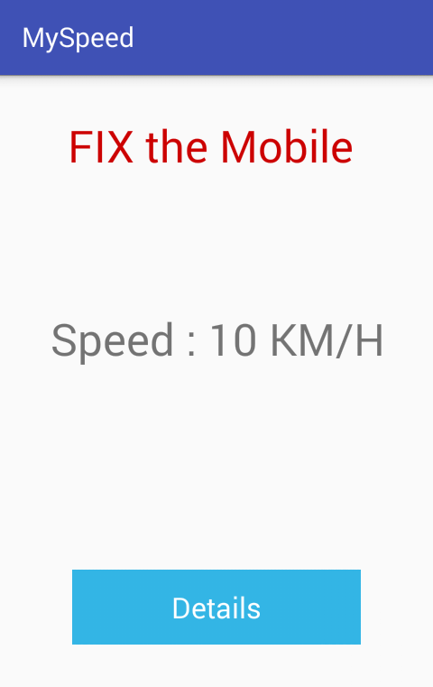
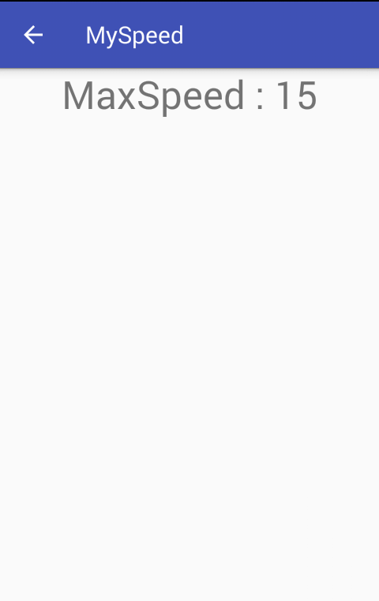

# MySpeed

MySpeed sample android app for getting current speed with your android phone
using accelerometer sensor to get x , y , z
App work with some condition :
- the movement must be linear
- Mobile must stay constant

## Open App

## Mobile not Constant

## Details MaxSpeed 

###### Keywords Project

- Android Sensor
- ACCELEROMETER
- Speed
- SharedPreferences

